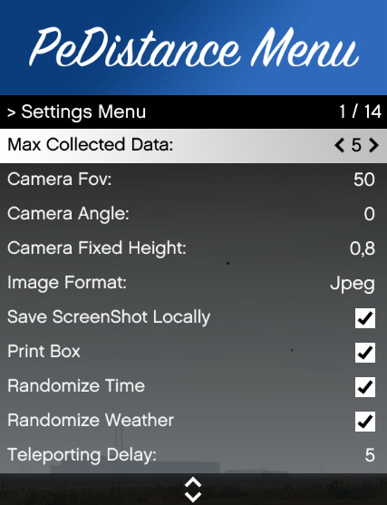

# PeDistance

PeDistance is an automatic dataset generator useful to training Machine Learning or Computer Vision algoritms 

# Requirement

* PC with Windows Installed and minimum requirement
* Grand Theft Auto V (Epic or Steam Version)

# How to Start

* Start GTA V and enter in Story Mod
* deactivate all in game notification
* Press F5 to Open Menu
* Open settings menu and chose your favorite setting to collect data or leave default values
* Come back to main menu and press start collecting data to begin dataset creation
* Leave mod to work until it finishes to collect data (it can take a while)
* you will find collected data in MachineLearningProject Folder

- Data 
    - Location: where the player can spawn 
	- Dataset: it contains all data of ped in relative images
- Images
	- It will contains all screenshot (only if you checked Save Screenshot Locally in Settings Menu)

## Main menu

# Settings

settings menu is an important part of this project  

you can set
- MaxCollected data
- Camera Fov
- Camera Angle
- Camera Fixed Height
- Image Format
- Save Screenshot Locally
- Print Box
- Randomize Time
- Randomize Weather
- Various Delay

 

Extra Note 

Relative to your PC Specific, you should set various delays in the settings menu to manage the tenderization of the environment and all other stuff.
if your pc performances are low you should increment delays 
if your pc performances are high you should decrement delays 

 

once you finish collecting data you can find it in Folder MachineLearningProject 

About Developers

* FoxAlex98
* WarCreed
* Wornairz

# Reference
* ScriptHookV
* Yolo
* CsvHelper